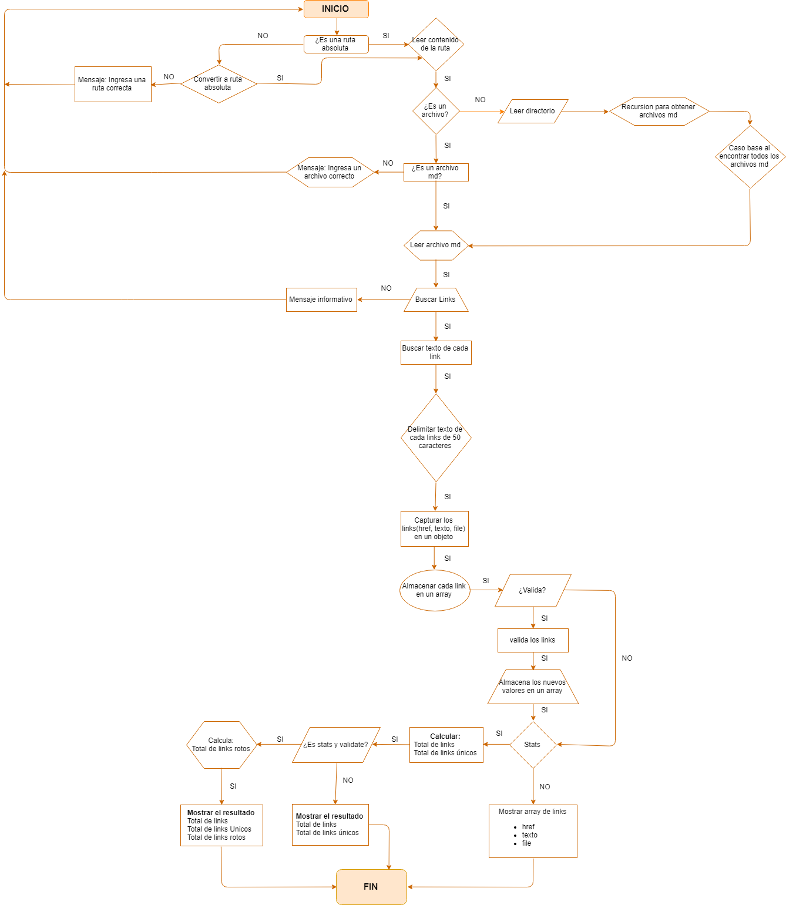
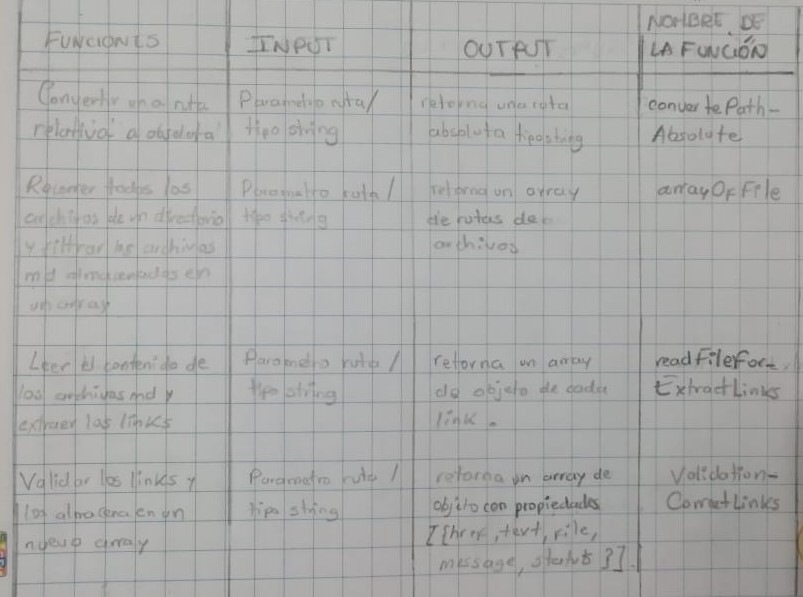
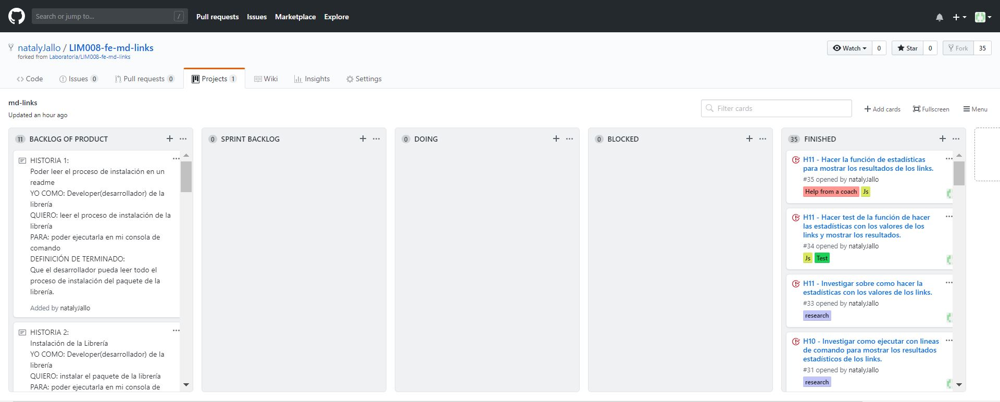
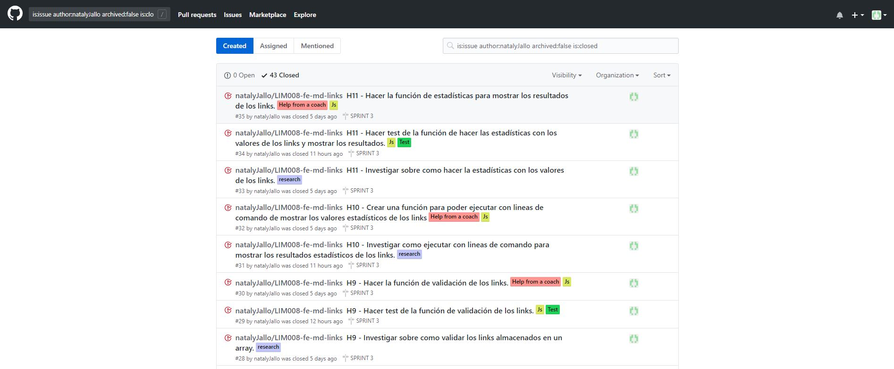
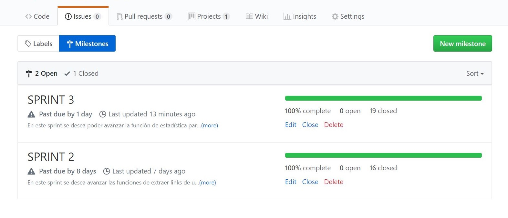

# Markdown Links

## Preámbulo

Markdown Links es una libreria que extrae y valida cada link que haya dentro de un archivo o directorio en formato markdown.

## Instalación

Para instalar esta libreria debe ejecutar la siguiente linea de comando:

`npm i natalyJallo/LIM008-fe-md-links`

Tambien puedes invocar en la línea de comando como una interfaz que puedas
importar con `require` para usarlo programáticamente.

#### `mdLinks(path, options)`

##### Argumentos

- `path`: Ruta absoluta o relativa al archivo o directorio. 
- `options`: Opciones que que se ejecutara en la linea de comando.
  * `validate`

##### Valor de retorno

La función validate retornara cada objeto que representa un link y contiene
las siguientes propiedades:

- `href`: URL encontrada.
- `text`: Texto que aparecía dentro del link (`<a>`).
- `file`: Ruta del archivo donde se encontró el link.

#### Ejemplo

```js
const mdLinks = require("md-links");

mdLinks("./some/example.md")
  .then(links => {
    // => [{ href, text, file }]
  })
  .catch(console.error);

mdLinks("./some/example.md", { validate: true })
  .then(links => {
    // => [{ href, text, file, status, ok }]
  })
  .catch(console.error);

mdLinks("./some/dir")
  .then(links => {
    // => [{ href, text, file }]
  })
  .catch(console.error);
```

### CLI (Command Line Interface - Interfaz de Línea de Comando)

El ejecutable de nuestra aplicación se puede ejecutar a través de la terminal:

`md-links <path-to-file> [options]`

Por ejemplo:

```sh
$ md-links ./some/example.md
./some/example.md http://algo.com/2/3/ Link a algo
./some/example.md https://otra-cosa.net/algun-doc.html algún doc
./some/example.md http://google.com/ Google
```
#### Help

Te mostrara las opciones que tiene la libreria para ejecutarse en la linea de comando.

`md-links --help`

#### Options

##### `--validate`

Si pasamos la opción `--validate`, el módulo debe hacer una petición HTTP para
averiguar si el link funciona o no. Si el link resulta en una redirección a una
URL que responde ok, entonces consideraremos el link como ok.

Por ejemplo:

```sh
$ md-links ./some/example.md --validate
./some/example.md http://algo.com/2/3/ ok 200 Link a algo
./some/example.md https://otra-cosa.net/algun-doc.html fail 404 algún doc
./some/example.md http://google.com/ ok 301 Google
```

##### `--stats`

Si pasamos la opción `--stats` el output (salida) será un texto con estadísticas
básicas sobre los links.

```sh
$ md-links ./some/example.md --stats
Total: 3
Unique: 3
```

También podemos combinar `--stats` y `--validate` para obtener estadísticas que
necesiten de los resultados de la validación.

```sh
$ md-links ./some/example.md --stats --validate
Total: 3
Unique: 3
Broken: 1
```

## Iplementacion de la libreria
Se creo el flujograma para tener una guía de la implementación y poder definir la arquitectura del proyecto.



Como siguiente paso se creo un cuadro con las funciones a crear, input, output y los nombres de las funciones a implementar.



Se hizo uso de las herramientas de GitHub para la organización y planificación del proyecto como los milestone, issues, project.

Project: 

[GitHub](https://github.com/natalyJallo/LIM008-fe-md-links/projects/1)



Issues:



Milestone:

